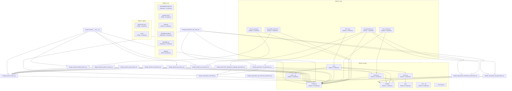
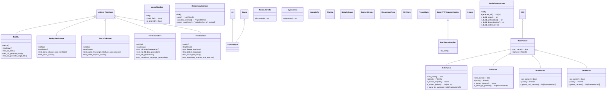

# Arquitetura e Fluxo de Dados: doc-gen

## Diagrama de Componentes e Módulos

```mermaid
flowchart TB
    subgraph sub_root["Módulo: root"]
        DOCUMENTATION_md["DOCUMENTATION.md\n(Markdown, 0 símbolos)"]
        pyproject_toml["pyproject.toml\n(TOML, 0 símbolos)"]
        setup_py["setup.py\n(Python, 0 símbolos)"]
        README_pt_BR_md["README.pt-BR.md\n(Markdown, 0 símbolos)"]
        README_md["README.md\n(Markdown, 0 símbolos)"]
        gitignore[".gitignore\n(Other, 0 símbolos)"]
    end
    subgraph sub_github["Módulo: .github"]
        github_workflows_deploy_docs_yml["deploy-docs.yml\n(YAML, 0 símbolos)"]
        github_workflows_ci_yml["ci.yml\n(YAML, 0 símbolos)"]
    end
    subgraph sub_tests["Módulo: tests"]
        tests_test_cli_py["test_cli.py\n(Python, 1 símbolos)"]
        tests_test_python_parser_py["test_python_parser.py\n(Python, 1 símbolos)"]
        tests_test_js_parser_py["test_js_parser.py\n(Python, 1 símbolos)"]
        tests_test_generators_py["test_generators.py\n(Python, 1 símbolos)"]
        tests_test_scanner_py["test_scanner.py\n(Python, 1 símbolos)"]
    end
    subgraph sub_docgen["Módulo: docgen"]
        docgen_scanner_py["scanner.py\n(Python, 4 símbolos)"]
        docgen___main___py["__main__.py\n(Python, 0 símbolos)"]
        docgen_cli_py["cli.py\n(Python, 5 símbolos)"]
        docgen_models_py["models.py\n(Python, 10 símbolos)"]
        docgen_config_py["config.py\n(Python, 1 símbolos)"]
        docgen_server_py["server.py\n(Python, 3 símbolos)"]
        docgen_ui_py["ui.py\n(Python, 8 símbolos)"]
        docgen___init___py["__init__.py\n(Python, 0 símbolos)"]
        sub_docgen_more["... +16 arquivos"]
    end
    tests_test_cli_py --> docgen_cli_py
    tests_test_python_parser_py --> docgen_models_py
    tests_test_python_parser_py --> docgen_parsers_python_parser_py
    tests_test_js_parser_py --> docgen_models_py
    tests_test_js_parser_py --> docgen_parsers_js_ts_parser_py
    tests_test_generators_py --> docgen_models_py
    tests_test_generators_py --> docgen_generators_c4_generator_py
    tests_test_generators_py --> docgen_generators_architecture_generator_py
    tests_test_generators_py --> docgen_generators_adr_generator_py
    tests_test_generators_py --> docgen_generators_ubiquitous_language_generator_py
    tests_test_scanner_py --> docgen_scanner_py
    tests_test_scanner_py --> docgen_models_py
    docgen_scanner_py --> docgen_config_py
    docgen_scanner_py --> docgen_models_py
    docgen___main___py --> docgen_cli_py
    docgen_cli_py --> docgen_scanner_py
    docgen_cli_py --> docgen___main___py
    docgen_cli_py --> docgen_models_py
    docgen_cli_py --> docgen_config_py
    docgen_cli_py --> docgen_server_py
    docgen_server_py --> docgen_ui_py
    docgen_generators_c4_generator_py --> docgen_models_py
    docgen_generators_c4_generator_py --> docgen_config_py
    docgen_generators_c4_generator_py --> docgen_generators_mermaid_py
    docgen_generators_ubiquitous_language_generator_py --> docgen_models_py
    docgen_generators_ubiquitous_language_generator_py --> docgen_generators_mermaid_py
    docgen_generators_api_reference_generator_py --> docgen_models_py
    docgen_generators_adr_generator_py --> docgen_models_py
    docgen_generators_adr_generator_py --> docgen_config_py
    docgen_generators_doc_suite_py --> docgen_models_py
    docgen_generators_doc_suite_py --> docgen_generators_mermaid_py
    docgen_generators_doc_suite_py --> docgen_generators_c4_generator_py
    docgen_generators_doc_suite_py --> docgen_generators_architecture_generator_py
    docgen_generators_doc_suite_py --> docgen_generators_adr_generator_py
    docgen_generators_mermaid_py --> docgen_models_py
    docgen_generators_architecture_generator_py --> docgen_models_py
    docgen_generators_architecture_generator_py --> docgen_config_py
    docgen_parsers_base_py --> docgen_models_py
    docgen_parsers_js_ts_parser_py --> docgen_models_py
    docgen_parsers_js_ts_parser_py --> docgen_parsers_base_py
    docgen_parsers_go_parser_py --> docgen_models_py
    docgen_parsers_go_parser_py --> docgen_parsers_base_py
    docgen_parsers_rust_parser_py --> docgen_models_py
    docgen_parsers_rust_parser_py --> docgen_parsers_base_py
    docgen_parsers_java_parser_py --> docgen_models_py
    docgen_parsers_java_parser_py --> docgen_parsers_base_py
    docgen_parsers_generic_parser_py --> docgen_models_py
    docgen_parsers_generic_parser_py --> docgen_parsers_base_py
    docgen_parsers_python_parser_py --> docgen_models_py
    docgen_parsers_python_parser_py --> docgen_parsers_base_py
    docgen_parsers___init___py --> docgen_models_py
    docgen_parsers___init___py --> docgen_parsers_base_py
    docgen_parsers___init___py --> docgen_parsers_python_parser_py
    docgen_parsers___init___py --> docgen_parsers_js_ts_parser_py
    docgen_parsers___init___py --> docgen_parsers_go_parser_py
```

---

## Diagrama de Classes e Entidades

```mermaid
classDiagram
    class TestCLI {
        +setUp()
        +tearDown()
        +test_cli_stats()
        +test_cli_generate_multi()
        +test_cli_generate_single_file()
    }
    unittest_TestCase <|-- TestCLI
    class TestPythonParser {
        +setUp()
        +tearDown()
        +test_parse_classes_and_methods()
        +test_parse_routes()
    }
    unittest_TestCase <|-- TestPythonParser
    class TestJsTsParser {
        +setUp()
        +tearDown()
        +test_parse_typescript_interfaces_and_classes()
        +test_parse_express_routes()
    }
    unittest_TestCase <|-- TestJsTsParser
    class TestGenerators {
        +setUp()
        +tearDown()
        +test_c4_model_generation()
        +test_hld_lld_das_generation()
        +test_adr_generation()
        +test_ubiquitous_language_generation()
    }
    unittest_TestCase <|-- TestGenerators
    class TestScanner {
        +setUp()
        +tearDown()
        +test_ignore_matcher()
        +test_detect_language()
        +test_count_file_lines()
        +test_repository_scanner_and_metrics()
    }
    unittest_TestCase <|-- TestScanner
    class IgnoreMatcher {
        +__init__()
        +_load_file(): None
        +is_ignored(): bool
    }
    class RepositoryScanner {
        +__init__()
        +scan(): List[FileInfo]
        +calculate_metrics(): ProjectMetrics
        +detect_manifests(): Tuple[Dict[str, str], List[str]]
    }
    class SymbolType {
    }
    str <|-- SymbolType
    Enum <|-- SymbolType
    class ParameterInfo {
        +formatted(): str
    }
    class SymbolInfo {
        +signature(): str
    }
    class ImportInfo {
    }
    class FileInfo {
    }
    class ModuleGroup {
    }
    class ProjectMetrics {
    }
    class UbiquitousTerm {
    }
    class ADRItem {
    }
    class ProjectData {
    }
    class DocViewerHandler {
        +do_GET()
    }
    BaseHTTPRequestHandler <|-- DocViewerHandler
    class Colors {
    }
    class DocSuiteGenerator {
        +__init__()
        +generate_all(): List[str]
        +_build_index(): str
        +_build_architecture(): str
        +_build_dependencies(): str
        +_build_metrics(): str
    }
    class BaseParser {
        +can_parse(): bool
        +parse(): FileInfo
    }
    ABC <|-- BaseParser
    class JsTsParser {
        +can_parse(): bool
        +parse(): FileInfo
        +_extract_imports(): None
        +_extract_jsdocs(): dict[int, str]
        +_parse_ts_params(): List[ParameterInfo]
    }
    BaseParser <|-- JsTsParser
    class GoParser {
        +can_parse(): bool
        +parse(): FileInfo
        +_extract_imports(): None
        +_parse_go_params(): list[ParameterInfo]
    }
    BaseParser <|-- GoParser
    class RustParser {
        +can_parse(): bool
        +parse(): FileInfo
        +_parse_rust_params(): list[ParameterInfo]
    }
    BaseParser <|-- RustParser
    class JavaParser {
        +can_parse(): bool
        +parse(): FileInfo
        +_parse_params(): list[ParameterInfo]
    }
    BaseParser <|-- JavaParser
```
