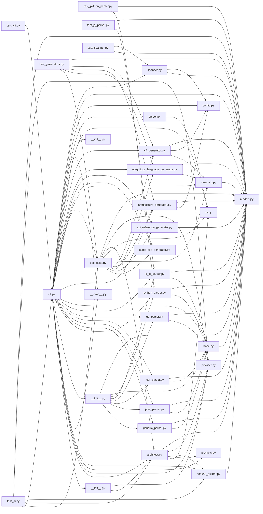

# Dependências do Projeto: doc-gen

## Grafo de Dependências Internas

```mermaid
graph LR
    tests_test_cli_py["test_cli.py"] --> docgen_cli_py["cli.py"]
    tests_test_python_parser_py["test_python_parser.py"] --> docgen_models_py["models.py"]
    tests_test_python_parser_py["test_python_parser.py"] --> docgen_parsers_python_parser_py["python_parser.py"]
    tests_test_js_parser_py["test_js_parser.py"] --> docgen_models_py["models.py"]
    tests_test_js_parser_py["test_js_parser.py"] --> docgen_parsers_js_ts_parser_py["js_ts_parser.py"]
    tests_test_ai_py["test_ai.py"] --> docgen_models_py["models.py"]
    tests_test_ai_py["test_ai.py"] --> docgen_ai_provider_py["provider.py"]
    tests_test_ai_py["test_ai.py"] --> docgen_ai_context_builder_py["context_builder.py"]
    tests_test_ai_py["test_ai.py"] --> docgen_ai_architect_py["architect.py"]
    tests_test_ai_py["test_ai.py"] --> docgen_generators_doc_suite_py["doc_suite.py"]
    tests_test_ai_py["test_ai.py"] --> docgen_cli_py["cli.py"]
    tests_test_generators_py["test_generators.py"] --> docgen_models_py["models.py"]
    tests_test_generators_py["test_generators.py"] --> docgen_generators_c4_generator_py["c4_generator.py"]
    tests_test_generators_py["test_generators.py"] --> docgen_generators_architecture_generator_py["architecture_generator.py"]
    tests_test_generators_py["test_generators.py"] --> docgen_generators_ubiquitous_language_generator_py["ubiquitous_language_generator.py"]
    tests_test_generators_py["test_generators.py"] --> docgen_generators_doc_suite_py["doc_suite.py"]
    tests_test_scanner_py["test_scanner.py"] --> docgen_scanner_py["scanner.py"]
    tests_test_scanner_py["test_scanner.py"] --> docgen_models_py["models.py"]
    docgen_scanner_py["scanner.py"] --> docgen_config_py["config.py"]
    docgen_scanner_py["scanner.py"] --> docgen_models_py["models.py"]
    docgen___main___py["__main__.py"] --> docgen_cli_py["cli.py"]
    docgen_cli_py["cli.py"] --> docgen_scanner_py["scanner.py"]
    docgen_cli_py["cli.py"] --> docgen___main___py["__main__.py"]
    docgen_cli_py["cli.py"] --> docgen_models_py["models.py"]
    docgen_cli_py["cli.py"] --> docgen_config_py["config.py"]
    docgen_cli_py["cli.py"] --> docgen_server_py["server.py"]
    docgen_cli_py["cli.py"] --> docgen_ui_py["ui.py"]
    docgen_cli_py["cli.py"] --> docgen___init___py["__init__.py"]
    docgen_cli_py["cli.py"] --> docgen_generators_c4_generator_py["c4_generator.py"]
    docgen_cli_py["cli.py"] --> docgen_generators_ubiquitous_language_generator_py["ubiquitous_language_generator.py"]
    docgen_cli_py["cli.py"] --> docgen_generators_api_reference_generator_py["api_reference_generator.py"]
    docgen_cli_py["cli.py"] --> docgen_generators_doc_suite_py["doc_suite.py"]
    docgen_cli_py["cli.py"] --> docgen_generators_static_site_generator_py["static_site_generator.py"]
    docgen_cli_py["cli.py"] --> docgen_generators_mermaid_py["mermaid.py"]
    docgen_cli_py["cli.py"] --> docgen_generators_architecture_generator_py["architecture_generator.py"]
    docgen_cli_py["cli.py"] --> docgen_parsers_base_py["base.py"]
    docgen_cli_py["cli.py"] --> docgen_parsers_js_ts_parser_py["js_ts_parser.py"]
    docgen_cli_py["cli.py"] --> docgen_parsers_go_parser_py["go_parser.py"]
    docgen_cli_py["cli.py"] --> docgen_parsers_rust_parser_py["rust_parser.py"]
    docgen_cli_py["cli.py"] --> docgen_parsers_java_parser_py["java_parser.py"]
    docgen_cli_py["cli.py"] --> docgen_parsers_generic_parser_py["generic_parser.py"]
    docgen_cli_py["cli.py"] --> docgen_parsers_python_parser_py["python_parser.py"]
    docgen_cli_py["cli.py"] --> docgen_parsers___init___py["__init__.py"]
    docgen_cli_py["cli.py"] --> docgen_ai_context_builder_py["context_builder.py"]
    docgen_cli_py["cli.py"] --> docgen_ai_prompts_py["prompts.py"]
    docgen_cli_py["cli.py"] --> docgen_ai_provider_py["provider.py"]
    docgen_cli_py["cli.py"] --> docgen_ai_architect_py["architect.py"]
    docgen_cli_py["cli.py"] --> docgen_ai___init___py["__init__.py"]
    docgen_server_py["server.py"] --> docgen_ui_py["ui.py"]
    docgen_generators_c4_generator_py["c4_generator.py"] --> docgen_models_py["models.py"]
    docgen_generators_c4_generator_py["c4_generator.py"] --> docgen_config_py["config.py"]
    docgen_generators_c4_generator_py["c4_generator.py"] --> docgen_generators_mermaid_py["mermaid.py"]
    docgen_generators_ubiquitous_language_generator_py["ubiquitous_language_generator.py"] --> docgen_models_py["models.py"]
    docgen_generators_ubiquitous_language_generator_py["ubiquitous_language_generator.py"] --> docgen_generators_mermaid_py["mermaid.py"]
    docgen_generators_api_reference_generator_py["api_reference_generator.py"] --> docgen_models_py["models.py"]
    docgen_generators_doc_suite_py["doc_suite.py"] --> docgen_models_py["models.py"]
    docgen_generators_doc_suite_py["doc_suite.py"] --> docgen_ai_provider_py["provider.py"]
    docgen_generators_doc_suite_py["doc_suite.py"] --> docgen_ai_architect_py["architect.py"]
    docgen_generators_doc_suite_py["doc_suite.py"] --> docgen_ui_py["ui.py"]
    docgen_generators_doc_suite_py["doc_suite.py"] --> docgen_generators_mermaid_py["mermaid.py"]
    docgen_generators_doc_suite_py["doc_suite.py"] --> docgen_generators_c4_generator_py["c4_generator.py"]
    docgen_generators_doc_suite_py["doc_suite.py"] --> docgen_generators_architecture_generator_py["architecture_generator.py"]
    docgen_generators_doc_suite_py["doc_suite.py"] --> docgen_generators_ubiquitous_language_generator_py["ubiquitous_language_generator.py"]
    docgen_generators_doc_suite_py["doc_suite.py"] --> docgen_generators_api_reference_generator_py["api_reference_generator.py"]
    docgen_generators_doc_suite_py["doc_suite.py"] --> docgen_generators_static_site_generator_py["static_site_generator.py"]
    docgen_generators_mermaid_py["mermaid.py"] --> docgen_models_py["models.py"]
    docgen_generators_architecture_generator_py["architecture_generator.py"] --> docgen_models_py["models.py"]
    docgen_generators_architecture_generator_py["architecture_generator.py"] --> docgen_config_py["config.py"]
    docgen_parsers_base_py["base.py"] --> docgen_models_py["models.py"]
    docgen_parsers_js_ts_parser_py["js_ts_parser.py"] --> docgen_models_py["models.py"]
    docgen_parsers_js_ts_parser_py["js_ts_parser.py"] --> docgen_parsers_base_py["base.py"]
    docgen_parsers_go_parser_py["go_parser.py"] --> docgen_models_py["models.py"]
    docgen_parsers_go_parser_py["go_parser.py"] --> docgen_parsers_base_py["base.py"]
    docgen_parsers_rust_parser_py["rust_parser.py"] --> docgen_models_py["models.py"]
    docgen_parsers_rust_parser_py["rust_parser.py"] --> docgen_parsers_base_py["base.py"]
    docgen_parsers_java_parser_py["java_parser.py"] --> docgen_models_py["models.py"]
    docgen_parsers_java_parser_py["java_parser.py"] --> docgen_parsers_base_py["base.py"]
    docgen_parsers_generic_parser_py["generic_parser.py"] --> docgen_models_py["models.py"]
    docgen_parsers_generic_parser_py["generic_parser.py"] --> docgen_parsers_base_py["base.py"]
    docgen_parsers_python_parser_py["python_parser.py"] --> docgen_models_py["models.py"]
    docgen_parsers_python_parser_py["python_parser.py"] --> docgen_parsers_base_py["base.py"]
    docgen_parsers___init___py["__init__.py"] --> docgen_models_py["models.py"]
    docgen_parsers___init___py["__init__.py"] --> docgen_parsers_base_py["base.py"]
    docgen_parsers___init___py["__init__.py"] --> docgen_parsers_python_parser_py["python_parser.py"]
    docgen_parsers___init___py["__init__.py"] --> docgen_parsers_js_ts_parser_py["js_ts_parser.py"]
    docgen_parsers___init___py["__init__.py"] --> docgen_parsers_go_parser_py["go_parser.py"]
    docgen_parsers___init___py["__init__.py"] --> docgen_parsers_rust_parser_py["rust_parser.py"]
    docgen_parsers___init___py["__init__.py"] --> docgen_parsers_java_parser_py["java_parser.py"]
    docgen_parsers___init___py["__init__.py"] --> docgen_parsers_generic_parser_py["generic_parser.py"]
    docgen_ai_context_builder_py["context_builder.py"] --> docgen_models_py["models.py"]
    docgen_ai_architect_py["architect.py"] --> docgen_models_py["models.py"]
    docgen_ai_architect_py["architect.py"] --> docgen_ai_provider_py["provider.py"]
    docgen_ai_architect_py["architect.py"] --> docgen_ai_context_builder_py["context_builder.py"]
    docgen_ai_architect_py["architect.py"] --> docgen_ai_prompts_py["prompts.py"]
    docgen_ai_architect_py["architect.py"] --> docgen_ui_py["ui.py"]
    docgen_ai___init___py["__init__.py"] --> docgen_ai_provider_py["provider.py"]
    docgen_ai___init___py["__init__.py"] --> docgen_ai_architect_py["architect.py"]
```

---

## Dependências Externas Registradas
*Nenhuma dependência externa registrada em arquivos de manifesto.*
